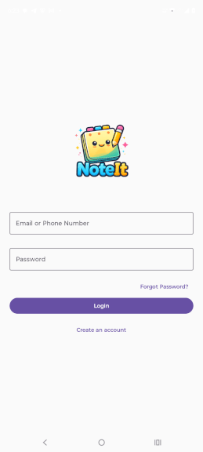

# 📝 NoteIt KMP

<p align="center">
  
</p>

<p align="center">
A beautiful, modern and cross-platform note-taking application built with
<b>Kotlin Multiplatform</b> and <b>Compose Multiplatform</b>.
</p>

<p align="center">


</p>

---

# 📖 About

**NoteIt KMP** is a modern note-taking application developed using **Kotlin Multiplatform (KMP)** and **Compose Multiplatform (CMP)**.

The project demonstrates how to build a scalable cross-platform application while sharing business logic across multiple platforms.

The application focuses on clean architecture, maintainable code, and a modern Material 3 user experience.

---

# ✨ Features

- ✅ Create Notes
- ✏️ Edit Notes
- 🗑 Delete Notes
- 📌 Pin Important Notes
- 🔍 Search Notes
- 🌙 Dark Mode
- 💾 Local Storage
- ⚡ Fast & Lightweight
- 🎨 Material 3 Design
- ♻️ Shared Business Logic using Kotlin Multiplatform

---

# 📱 Screenshots

> Replace these with your screenshots.

| Home | Add Note | Search | Dark Mode |
|------|----------|---------|-----------|
|  |  |  |  |

---

# 🎥 Demo

Add a GIF here.

Example:



---

# 🏗 Architecture

```
Presentation
      │
      ▼
ViewModel (MVVM)
      │
      ▼
Repository
      │
      ▼
Local Database
```

Following **Clean Architecture** principles:

```
UI
│
├── ViewModel
│
├── UseCases
│
├── Repository
│
└── Data Source
```

---

# 🛠 Tech Stack

## Language

- Kotlin

## UI

- Compose Multiplatform
- Material 3

## Architecture

- MVVM
- Clean Architecture

## Dependency Injection

- Koin

## Local Storage

- Room
- SQLite

## Async Programming

- Kotlin Coroutines
- Flow

## Navigation

- Navigation Compose

---

# 📂 Project Structure

```
composeApp/
shared/
androidApp/
desktopApp/
iosApp/
gradle/
```

---

# 🚀 Getting Started

## Clone Repository

```bash
git clone https://github.com/ganeshsharma-dev/NoteItKMP.git
```

## Open

Open the project using

- Android Studio
- IntelliJ IDEA

---

## Run Android

```bash
./gradlew installDebug
```

---

## Run Desktop

```bash
./gradlew desktopRun
```

---

# 📌 Roadmap

- [x] Create Notes
- [x] Edit Notes
- [x] Delete Notes
- [x] Search Notes
- [ ] Cloud Sync
- [ ] Authentication
- [ ] Rich Text Editor
- [ ] Image Notes
- [ ] Voice Notes
- [ ] Reminder Notifications
- [ ] Backup & Restore
- [ ] Markdown Support

---

# 🤝 Contributing

Contributions are welcome.

1. Fork the repository

2. Create a new branch

```bash
git checkout -b feature/NewFeature
```

3. Commit your changes

```bash
git commit -m "Added new feature"
```

4. Push

```bash
git push origin feature/NewFeature
```

5. Create a Pull Request

---

# 👨‍💻 Developer

## Ganesh Sharma

Senior Android & Kotlin Multiplatform Developer

### Expertise

- Android Development
- Kotlin
- Kotlin Multiplatform
- Compose Multiplatform
- MVVM
- Clean Architecture
- Jetpack Compose

GitHub

https://github.com/ganeshsharma-dev

LinkedIn

(Add your LinkedIn URL)

---

# ⭐ Show your support

If you like this project, please consider giving it a ⭐ on GitHub.

---

# 📄 License

This project is licensed under the MIT License.