# 📝 NoteIt KMP

<p align="center">
  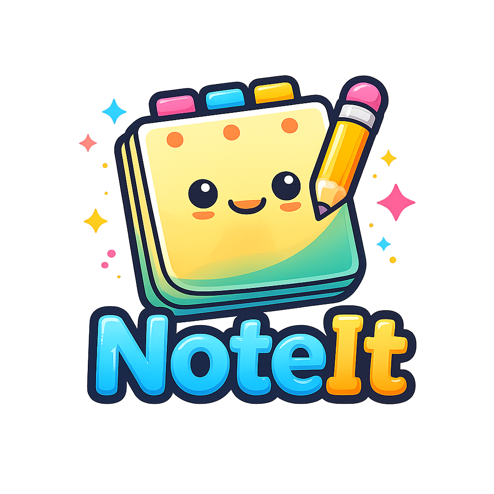
</p>

<p align="center">
A beautiful, modern and cross-platform note-taking application built with 
<b>Kotlin Multiplatform</b> and <b>Compose Multiplatform</b>.
</p>

<p align="center">


</p>

---

# 📖 About

**NoteIt KMP** is a modern note-taking application developed using **Kotlin Multiplatform (KMP)** and **Compose Multiplatform (CMP)**. 

The project demonstrates how to build a scalable cross-platform application while sharing business logic and UI across Android, iOS, and Desktop platforms.

The application focuses on clean architecture, maintainable code, and a modern Material 3 user experience.

---

# ✨ Features

- 🔐 **Authentication**: Secure Login, Signup, and Password Recovery.
- 📝 **CRUD Operations**: Create, Read, Update, and Delete notes seamlessly.
- 📌 **Favorites**: Pin important notes to your favorites for quick access.
- 🔍 **Search**: Powerful search to find your notes instantly.
- 🤝 **Share Notes**: Share your notes with other users within the app.
- 👤 **Profile Management**: Update your profile, change password, and manage your account.
- 🌙 **Dark Mode**: Fully supports Material 3 Dynamic coloring and Dark Mode.
- 💾 **Persistence**: Local settings management and remote sync.
- 🎨 **Material 3 Design**: Modern and clean UI using the latest Material Design components.
- ♻️ **Shared Business Logic**: 100% shared logic across platforms using Kotlin Multiplatform.

---

# 📱 Screenshots

| Login | Signup | Forgot Password |
|-------|--------|-----------------|
| 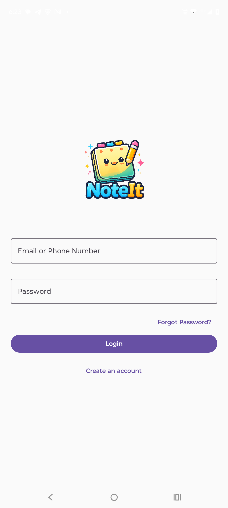 | 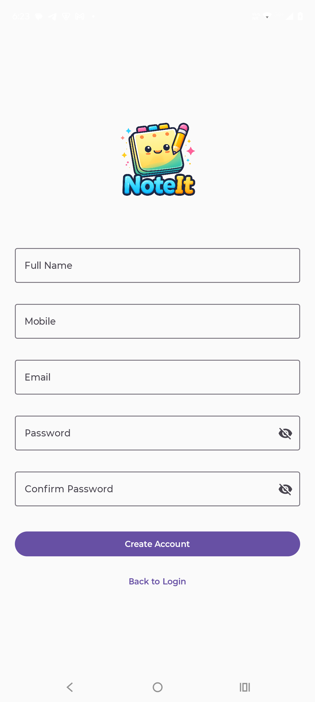 | 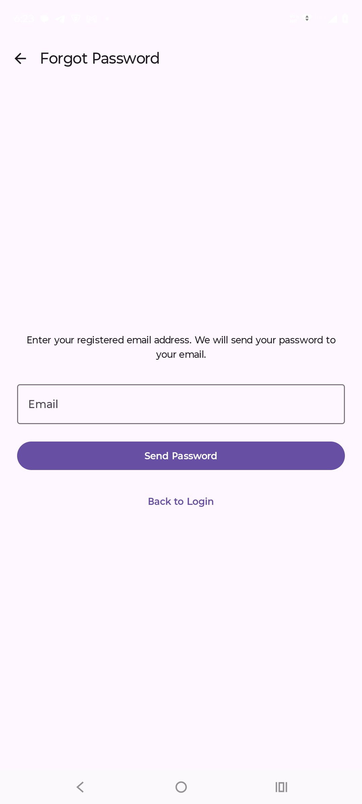 |

| Home (All Notes) | Add Note | Edit Note |
|------------------|----------|-----------|
| 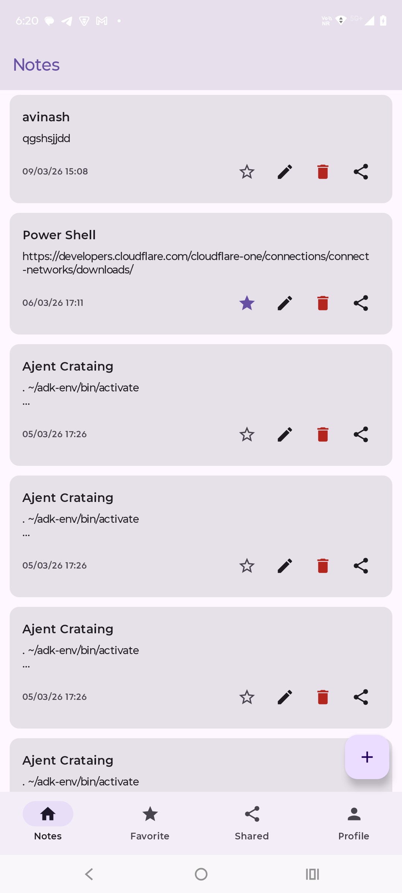 | 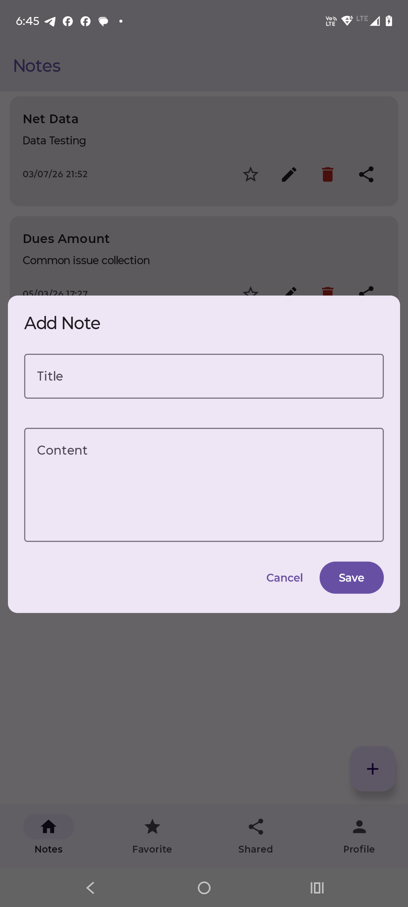 | 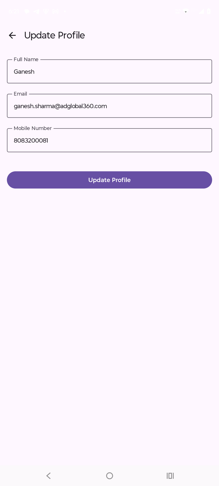 |

| Favorites | Shared Notes | Profile |
|-----------|--------------|---------|
| 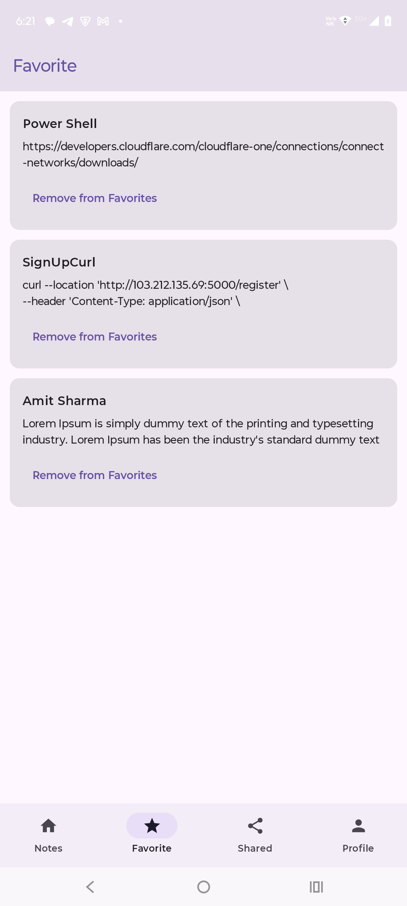 | 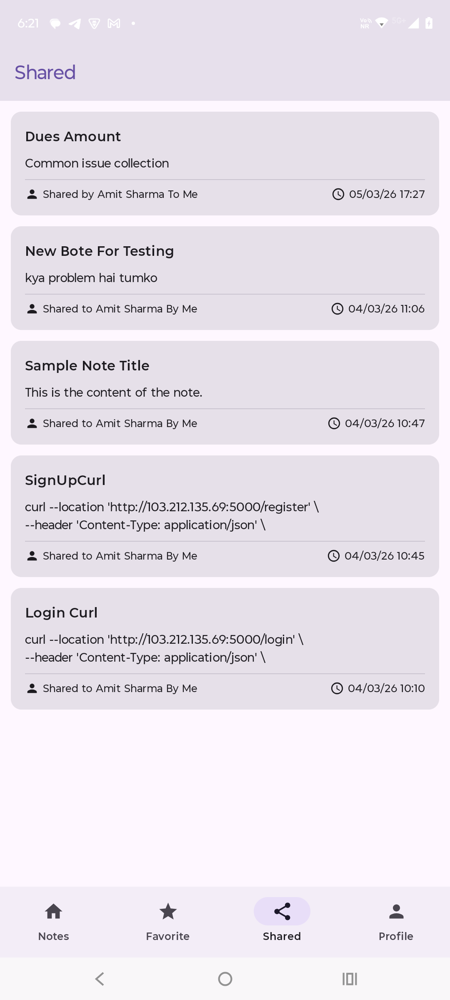 | 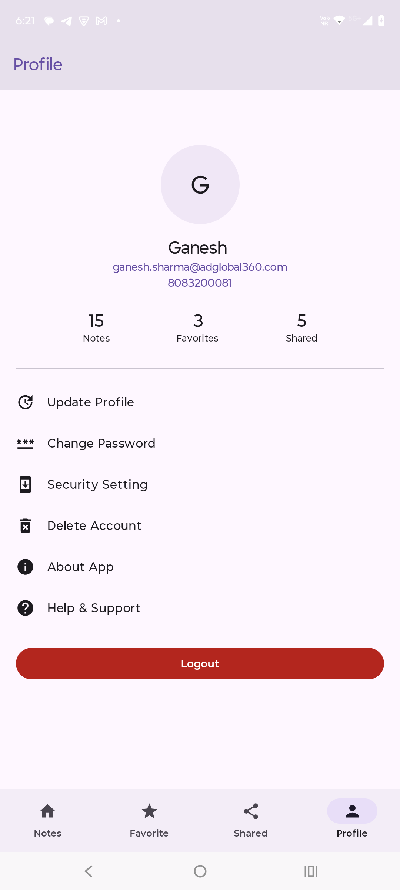 |

| Change Password | Help | Delete Account |
|-----------------|------|----------------|
| 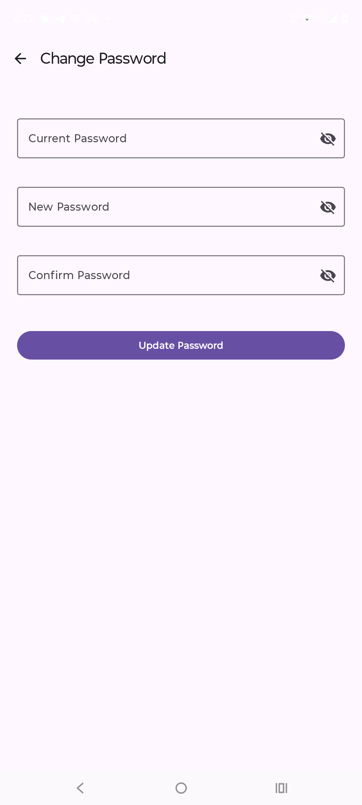 | 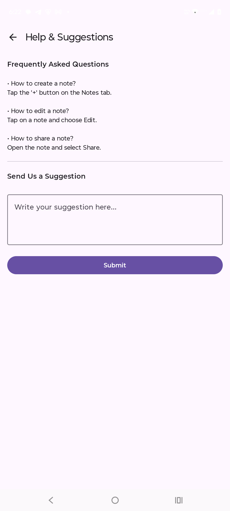 | 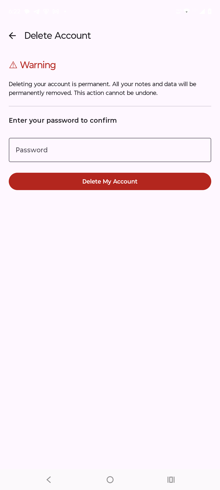 |

---

# 🎥 Demo


---

# 🏗 Architecture

```
Presentation (UI)
      │
      ▼
ViewModel (MVVM)
      │
      ▼
Repository (Logic)
      │
      ▼
Data Sources (Remote API / Local Settings)
```

Following **Clean Architecture** principles:

```
UI (Compose Multiplatform)
│
├── ViewModel (Shared)
│
├── Repository (Interface & Implementation)
│
└── Data Source (Ktor for API, Multiplatform Settings for Local)
```

---

# 🛠 Tech Stack

## Language
- Kotlin

## UI
- Compose Multiplatform
- Material 3
- Coil 3 (Image Loading)

## Architecture
- MVVM (Model-View-ViewModel)
- Clean Architecture
- Repository Pattern

## Dependency Injection
- Koin

## Networking
- Ktor (HTTP Client)
- Kotlinx Serialization

## Local Storage
- Multiplatform Settings (User Session & Preferences)

## Async Programming
- Kotlin Coroutines
- Kotlin Flow

## Navigation
- Navigation Compose

---

# 📂 Project Structure

```
.
├── composeApp/             # Main module containing shared code and platform targets
│   └── src/
│       ├── commonMain/     # Shared business logic and UI (Compose)
│       ├── androidMain/    # Android-specific implementations
│       ├── desktopMain/    # Desktop-specific implementations
│       └── iosMain/        # iOS-specific implementations
├── iosApp/                 # Xcode project for iOS
├── screenshots/            # Application screenshots and logo
└── gradle/                 # Gradle configuration files
```

---

# 🚀 Getting Started

## Clone Repository
```bash
git clone https://github.com/ganeshsharma-dev/NoteItKMP.git
```

## Open

Open the project using:
- **Android Studio** (Koala or later)
- **IntelliJ IDEA**

Make sure you have the **Kotlin Multiplatform** plugin installed.

---

## Run Android
```bash
./gradlew :composeApp:installDebug
```

---

## Run Desktop
```bash
./gradlew :composeApp:run
```

---

# 📌 Roadmap

- [x] Authentication (Login/Signup)
- [x] Create, Edit, Delete Notes
- [x] Favorite/Pin Notes
- [x] Search Notes
- [x] Share Notes with users
- [x] User Profile Management
- [x] Dark Mode Support
- [ ] Rich Text Editor
- [ ] Image Notes
- [ ] Voice Notes
- [ ] Markdown Support
- [ ] Offline Database (Room/SQLDelight integration)

---

# 🤝 Contributing

Contributions are welcome!

1. Fork the repository
2. Create a new branch (`git checkout -b feature/NewFeature`)
3. Commit your changes (`git commit -m "Added new feature"`)
4. Push to the branch (`git push origin feature/NewFeature`)
5. Create a Pull Request

---

# 👨‍💻 Developer

## Ganesh Sharma
**Senior Android & Kotlin Multiplatform Developer**

### Expertise
- Android Development (Jetpack Compose)
- Kotlin Multiplatform (KMP)
- Compose Multiplatform (CMP)
- Clean Architecture & MVVM

**GitHub**: [@ganeshsharma-dev](https://github.com/ganeshsharma-dev)

---

# ⭐ Show your support

If you like this project, please consider giving it a ⭐ on GitHub.

---

## 📄 License

This project is licensed under the **GNU General Public License v3.0**. See the [LICENSE](LICENSE) file for details.

---

*Developed with ❤️ by [Ganesh Sharma](https://github.com/ganeshsharma-dev)*